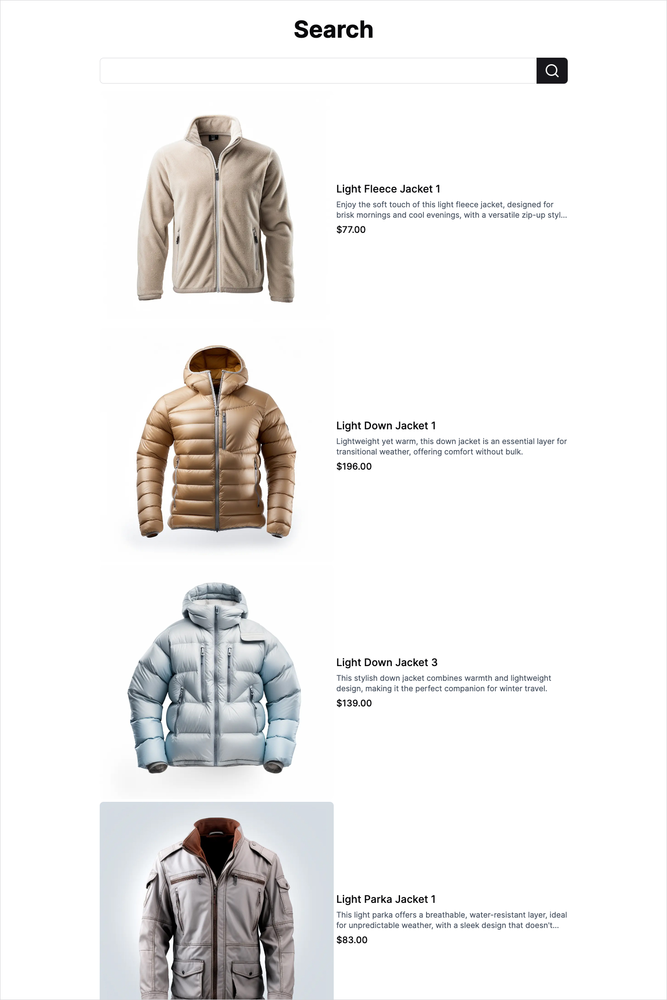
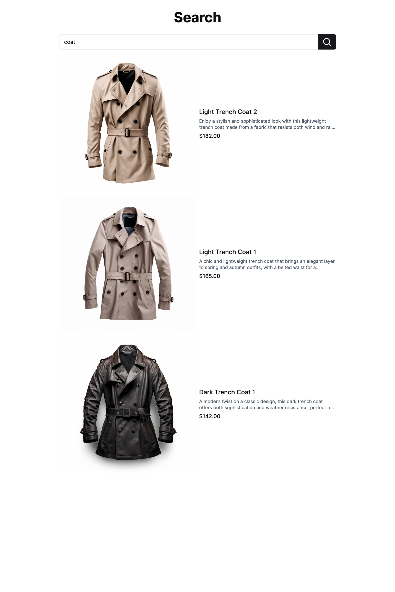
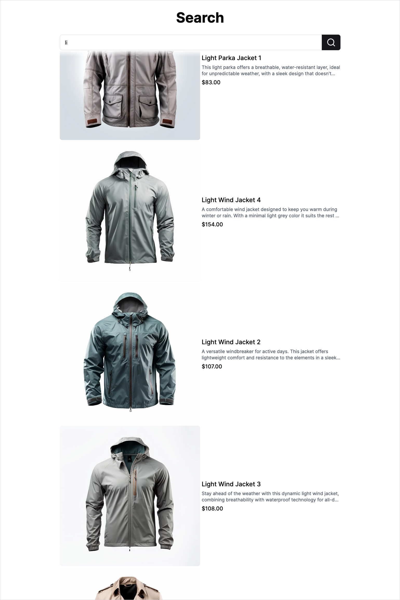
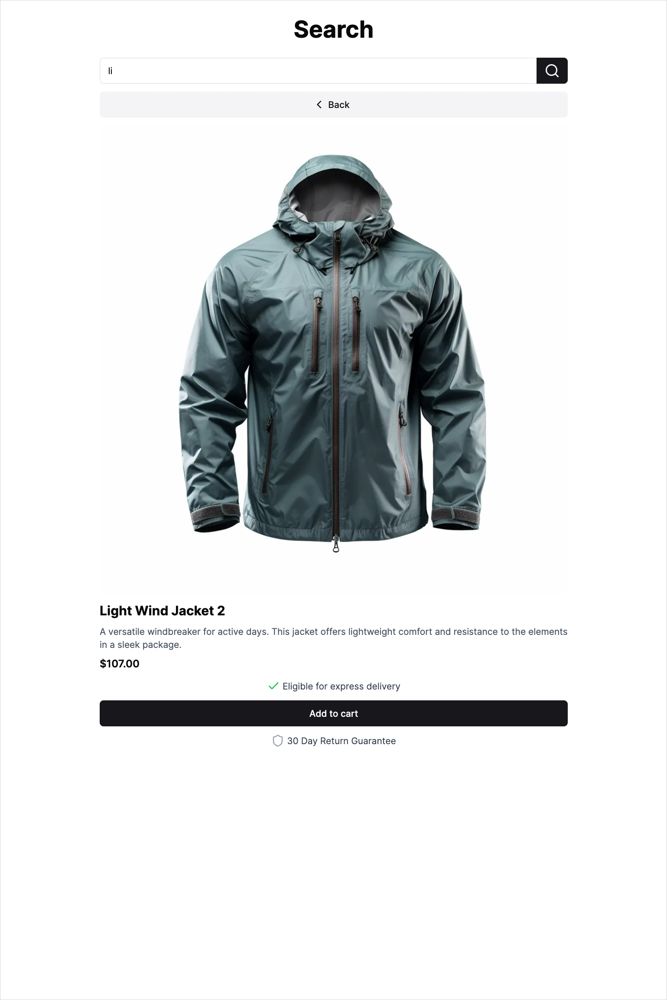

# Next.js 14 Search

## Overview

Developed using Next.js 14, this web application provides functionality to search data based on user-entered keywords.

[Live Demo](https://nextjs-14-search.vercel.app)

## Tech Stack

- Next.js, TypeScript
- Tailwind CSS
- shadcn/ui, Lucide
- Drizzle ORM, Neon

## Screenshot

